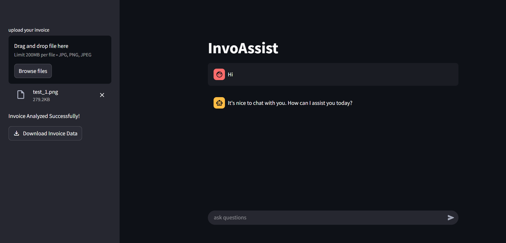

# 📦 InvoAssist

Invoice Query Assistant  

An AI assistant that allows users to interact and ask complex queries related to their purchase.

The invoice images are analyzed through AWS Textract and response is generated using Llama 3 Instruct (8B) model combined with LangChain's Buffer with summarizer (for storing conversation memory).

---

## ⚙️ Installation

```bash
# Clone the repository
git clone https://github.com/Sarvesh1604/InvoAssist.git
cd InvoAssist

# Install dependencies
pip install -r requirements.txt
```
---

## 🚀 Usage

```bash
# Run the Streamlit app
streamlit run app.py
```
> You can access the app at http://localhost:8501.

---

